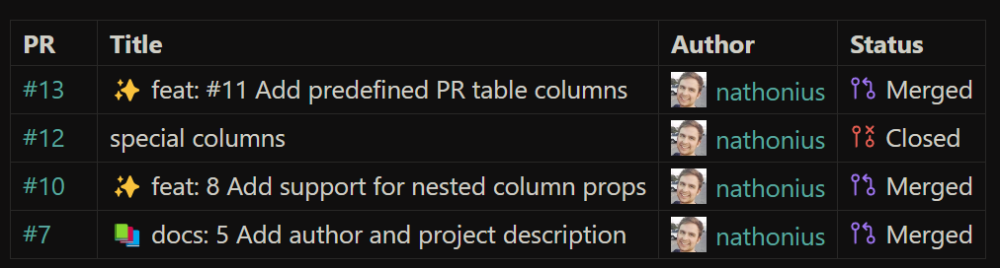

# GitHub Link

**Obsidian + GitHub ❤️**

Transform boring GitHub links in notes into tags with rich content from GitHub's API.

## Use

### Links

Github links are automatically transformed into tags. For example, pasting `https://github.com/nathonius/obsidian-github-link/issues/1` into a note will become:


### Table

You can also include a table with results from a search query using a `github-query` codeblock. For example:

````
```github-query
outputType: table
queryType: pull-request
query: "is:pr repo:nathonius/obsidian-github-link"
columns: [number, title, author, status]
```
````

This produces a table of results that refreshes upon opening the note.



The codeblock must be valid YAML. The following options are currently supported:

| Option       | Values                       | Description                                                                                                                                            |
| ------------ | ---------------------------- | ------------------------------------------------------------------------------------------------------------------------------------------------------ |
| `outputType` | `table`                      | Required. Only table is currently supported.                                                                                                           |
| `queryType`  | `pull-request`               | Required. Only pull requests are currently supported.                                                                                                  |
| `query`      | A valid GitHub search query. | Required. See the [GitHub docs](https://docs.github.com/en/search-github/searching-on-github/searching-issues-and-pull-requests) for more information. |
| `columns`    | See list below.              | Required. Should be an array of values.                                                                                                                |

#### Supported Columns

Any column not listed below can still be used if it is included in the API response. Nested values can be used by giving the json object notation string to reference the value. For example, `user.login` will get the raw value of the username from the API query response.

| Column                         | Types          | Description                                                    |
| ------------------------------ | -------------- | -------------------------------------------------------------- |
| `number`                       | `pull-request` | The PR number and a link to the PR.                            |
| `repo`                         | `pull-request` | A link to the repository.                                      |
| `author`                       | `pull-request` | The user who created the PR along with a small avatar.         |
| `status`                       | `pull-request` | The current status of the pull request.                        |
| `created`, `updated`, `closed` | `pull-request` | Formatted versions of the create, last update, and close date. |

## Setup

For public repositories, no extra configuration is required. For private repos, you'll need to log in through GitHub.

### Authentication

Authentication only requires a GitHub account. In GitHub Link plugin settings, add a new account. Give the account a name.

The plugin supports an automated authentication flow, or you can [generate your own token](https://github.com/settings/tokens). To use the automated flow, select "Generate Token". In the modal that appears, copy the code and open the authentication link. After pasting the auth link, you'll be prompted to allow access to the GitHub Link plugin. Once accepted, you can return to Obsidian and the token will be saved automatically.
